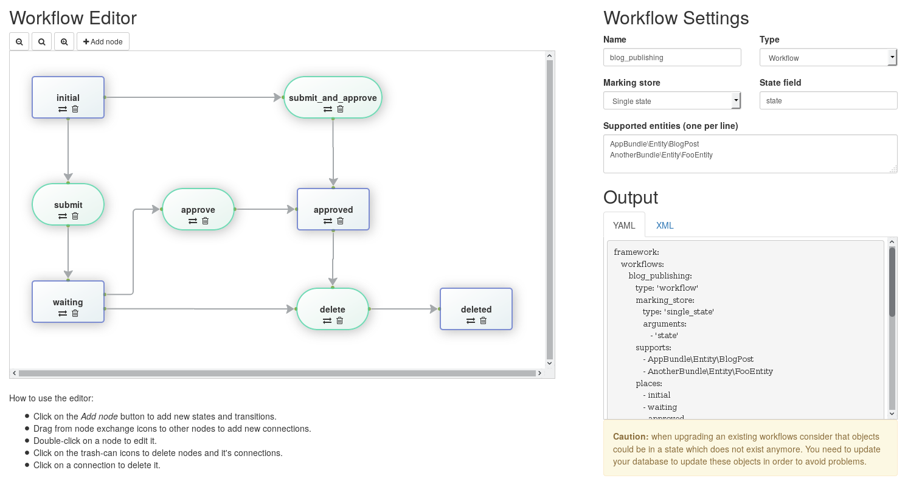

# Workflows

Zikula utilises the Symfony Workflow component to provide workflow functionality.

You can read more about it in [the manual](https://symfony.com/doc/master/components/workflow.html).

Because this is for Symfony 3 only we use [a backport](https://github.com/fduch/workflow-bundle/) in Zikula 1.4. Thus workflow configuration must be set under `workflow` section instead of `framework` section. In Zikula 2.x we will remove the backport again.

## Custom functionality

There are some slight differences regarding workflow behaviour in Zikula.

### Workflow locations

It seems that usually workflow definitions can only be stored at a central location. We wanted to make this more flexible so we allowed three different levels:

1. Central workflows in the core system are placed in: `lib/Zikula/Bundle/CoreBundle/Resources/workflows/`
2. Modules can define their own workflows in: `modules/Acme/MyBundle/Resources/workflows/`
3. Also it is possible to define custom workflows (or override existing ones) in: `app/Resources/workflows/`

Each of these directories may contain several YML (`*.yml`) or XML (`*.xml`) files.

**Caution:** when overriding existing workflows in `app/Resources/workflows/someFile.yml` (or `someFile.xml`) ensure that these workflows get new, unique names. Otherwise transitions will be added to the original workflow instead of redefining a custom workflow.

### Workflow editor

Zikula provides a JavaScript-based workflow editor.

At the moment it supports YAML and XML output.

**TODO** add missing information
